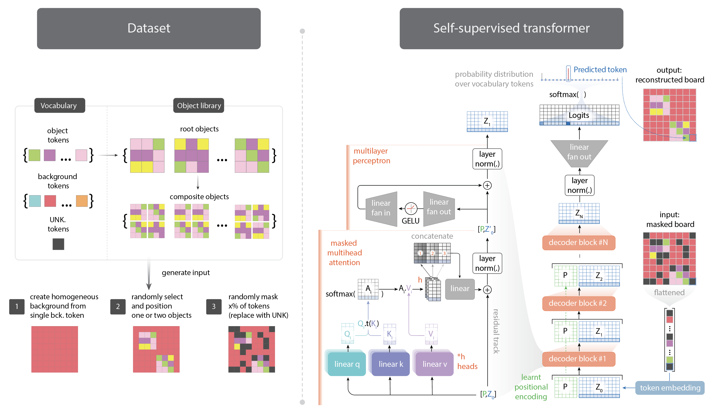
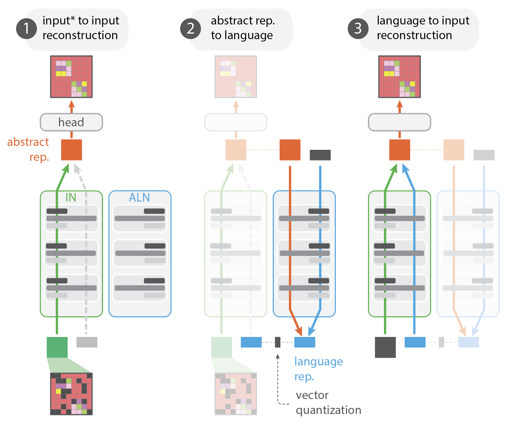

# Emergence and Function of Abstract Representations in Self-Supervised Transformers
(mi_transformers_abstract)
[](https://opensource.org/licenses/MIT)
---
This repository hosts the official implementation for generating datasets and training factorized transformer models, as described in the [paper](https://arxiv.org/abs/2312.05361) _"Emergence and Function of Abstract Representations in Self-Supervised Transformers"_ by Quentin RV. Ferry, Joshua Ching, and Takashi Kawai. While the main focus of the paper is on the analysis of transformer activations, this repository aims to provide a solid foundation for researchers and enthusiasts to replicate the study's environment and preliminary steps.



In addition to studying the inner workings of the classic transformer architecture, we also introduced a novel _language-enhanced architecture_ (LEA), which was designed to encourage the vanilla transformer to "talk" about the abstractions it learns through training (see [original paper](https://arxiv.org/abs/2312.05361) and figure below for details). LEA is trained on the same datasets as the factorized transformer models, and the code for training the LEA model is also included in this repository.



## Overview

The mechanistic interpretability paper sheds light on the inner workings of self-supervised transformers. In particular, we study the formation of abstract representations and show that they play a critical role in the decision-making of these networks. This repository complements the paper by offering the tools necessary to create datasets and train factorized transformer models, laying the groundwork for further exploration and analysis.

## Features

- **Dataset Generation**: Scripts to generate and preprocess datasets as used in the experiments.
- **Model Training**: Implementation of the factorized transformer models, allowing users to train models under the same settings as those described in the paper.

## Scripts
- `utils.py`: Implements helper functions.
- `module_dataset.py`: Implements dataset class.
<br>
**Relating to the training of factorized transformer models**:

- `module_transformer_factor.py`: Implements transformer with factorized token embeddings and position encodings.
- `module_train_probe.py`: Implements wrapper class for training and probing the transformer.
- `train_model.py`: Script used to train the model.
<br>
**Relating to the training of language-enhanced architecture (LEA) models**:

- `module_transformer_lea.py`: Implements transformer with language-enhanced architecture.
- `module_train_probe_lea.py`: Implements wrapper class for training LEA models.
- `train_model_lea.py`: Script used to train the LEA model.

## Getting Started

### Prerequisites

- Python 3.8 or later
- PyTorch
- Other dependencies include:
   - `numpy`
   - `matplotlib`
   - `einops`
   - `json`
   - `pickle`
   - `wandb`

We provided the `environment.yml` file to create the environment. Simply run:

```bash
conda env create -f environment.yml
```

### Installation

1. Clone this repository:
   ```bash
   git clone https://github.com/qferryAI/mi_transformers_abstract.git
   ```
2. Create Python environment & install the required packages:
   ```bash
   conda env create -f environment.yml
   ```

### Usage

Run the scripts:
   ```bash
   python train_model.py
   ```

This script takes the following arguments:
- `--device`: Device to run the model on. Can be `cpu` or `cuda`.
- `--epoch`: Number of epochs to train the model.
- `--type`: Type of model to train. Currently, only `factor` is supported.
- `--batch`: Batch size.
- `--save`: Whether to save (`1`) the model or not (`0`).

Additional arguments relating to the dataset and model training can be set in the `train_model.py` file. See file for details.

# Citations
If you find our paper and code useful in your research, please consider citing our paper

```BibTeX
@article{ferry2023emergence,
  title={Emergence and Function of Abstract Representations in Self-Supervised Transformers},
  author={Quentin RV. Ferry and Joshua Ching and Takashi Kawai},
  journal={arXiv preprint arXiv:2312.05361},
  year={2023}
}
```

# TO DOs
- [ ] Add language-enhanced architecture and training script.

# License

This project is licensed under the MIT License - see the [LICENSE](LICENSE) file for details.

# Contact

If you have any questions, feel free to contact Quentin Ferry at [qferry.ai@gmail.com](mailto:qferry.ai@gmail.com)

